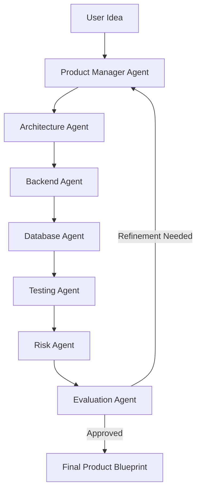

# 🚀 Multi-Agent AI Product Architect  
### Autonomous AI Team that Turns Ideas into Complete Product Plans

<p align="center">
  
  
 


</p>


> Build an **AI team**, not just
 a chatbot.
> 
> This project simulates a full cross-functional product squad powered by role-based LLM agents that collaborate to transform a raw idea into a production-ready product blueprint.

---

# 🧠 Overview

**Multi-Agent AI Product Architect** is an agentic AI system where specialized LLM agents collaborate autonomously to:

- 📄 Generate a Product Requirement Document (PRD)
- 🏗 Design System Architecture
- 🔌 Create API Schemas
- 🗄 Design Database Models
- 🧪 Produce Test Cases
- ⚠ Perform Risk Analysis
- 📊 Score & Evaluate Output Quality

Instead of a single prompt-response chatbot, this system demonstrates:

- Multi-agent coordination  
- Agent memory  
- Iterative refinement  
- Structured JSON outputs  
- Evaluation-based improvement loops  

---

# 👥 AI Agent Team

## 🧠 1. Product Manager Agent
- Converts raw idea → structured PRD
- Defines user personas
- Writes user stories
- Prioritizes features
- Defines KPIs

---

## 🏗 2. Architecture Agent
- Converts PRD → system design
- Creates:
  - Component diagram
  - Data flow
  - Tech stack recommendations
  - Scalability strategy

---

## 👨‍💻 3. Backend Agent
- Generates:
  - REST API schema (OpenAPI)
  - Endpoint definitions
  - Request/Response models
  - Authentication flow

---

## 🗄 4. Database Agent
- Designs:
  - Tables & relationships
  - ER model
  - Index strategy
  - Data constraints

---

## 🧪 5. Testing Agent
- Creates:
  - Unit tests
  - Integration tests
  - Edge case scenarios
  - API validation tests

---

## ⚠ 6. Risk Analysis Agent
- Identifies:
  - Technical risks
  - Security gaps
  - Scalability issues
  - Business dependencies

---

## 📊 7. Evaluation Agent
- Scores each output on:
  - Completeness
  - Clarity
  - Technical correctness
  - Internal consistency
- Triggers refinement loop if score < threshold

---

# 🏗 System Architecture Diagram



---

# 🔁 Agent Workflow

1. User submits product idea  
2. PM Agent drafts PRD  
3. Architecture Agent designs system  
4. Backend + DB agents define technical layer  
5. Testing Agent creates validation plan  
6. Risk Agent identifies vulnerabilities  
7. Evaluation Agent scores everything  
8. If needed → system refines automatically  

---

# 💡 Core Features

✅ Role-based prompting  
✅ Shared agent memory  
✅ Structured JSON outputs  
✅ Auto-evaluation loop  
✅ Modular agent architecture  
✅ LLM-agnostic design  
✅ Expandable agent system  

---

# 🛠 Tech Stack

- Python  
- FastAPI  
- OpenAI / Claude / Gemini APIs  
- Pydantic  
- LangChain / Custom Orchestrator  
- JSON-based memory store  

---

# 📂 Example Input

```json
{
  "idea": "Build a fitness tracking app for busy professionals",
  "target_users": "Working professionals aged 25-40",
  "platform": "Mobile + Web"
}
```

---

# 📤 Example Output Structure

```json
{
  "PRD": {...},
  "System_Architecture": {...},
  "API_Schema": {...},
  "Database_Model": {...},
  "Test_Cases": [...],
  "Risk_Assessment": {...},
  "Evaluation_Score": 8.9
}
```

---

# 📊 Skills Demonstrated

- 🧠 Multi-Agent Coordination  
- 🪄 Prompt Engineering  
- 🧱 Structured Output Design  
- 🔄 Workflow Automation  
- 📐 System Architecture Thinking  
- 📊 Evaluation & Feedback Loops  
- 🧩 Modular AI System Design  

---

# 📈 Impact

- 🚀 Reduced early-stage product planning effort by ~70%
- 📉 Minimized requirement ambiguity
- ⚡ Accelerated MVP definition
- 🧩 Improved documentation consistency

---

# 🏆 Perfect Pair With

If combined with:

**AI Codebase Intelligence Engine** → Shows deep RAG + code reasoning  
**Multi-Agent Product Architect** → Shows orchestration + system design  

Together they signal:

- You understand LLM internals  
- You can design scalable AI systems  
- You can build production-grade AI workflows  
- You are not a prompt-only engineer  

---

# 🚀 Future Improvements

- Add web dashboard  
- Real-time agent visualization  
- Vector database memory  
- Cost tracking per agent  
- Human-in-the-loop review  


---

⭐ If this project helped you, consider giving it a star!
